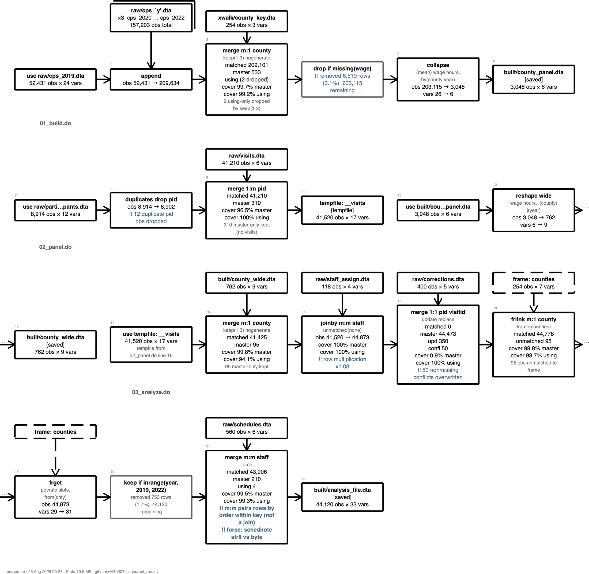
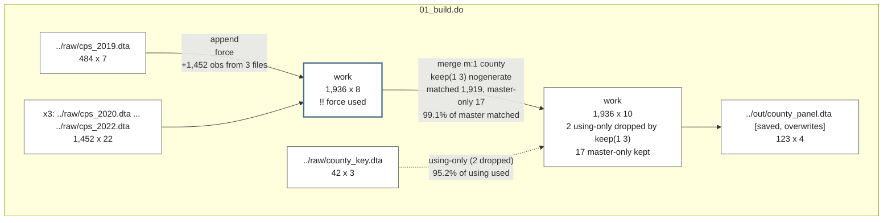

# mergemap

**Map the merges, appends and joins buried in your do-files, as a receipt, a diagram, or a figure for your appendix. It reads your code without running it, and runs it when you want the real numbers.**

`mergemap` reads a sequence of do-files and reports every `merge`, `append`, `joinby`, `cross`, `frlink` and `frget`, together with the reshaping steps around them (`reshape`, `collapse`, `contract`, `xpose`, `fillin`, `duplicates`) and the filtering steps that quietly change your row count (`keep if`, `drop if`). By default it **executes nothing**: it reads the code the way you would read it and prints a numbered receipt of what it found.


## Rationale / use case for this package:

**You inherited a project** with six numbered do-files, a `build/` folder, and no record of which file feeds which. Scanning them prints that record, before you have read a line of the code.

**A merge went wrong and you cannot find where.** The dataset came out at 1,448 rows and you expected 1,936. `mergemap` points you at the `drop if missing(hours)` on line 31 that took 488 of them. When a dataset comes out smaller than expected the merge usually gets the blame, and a `drop if` three lines later is usually the culprit, so both appear in the picture.

**Your methods appendix needs a figure of the data pipeline.** So might a data-management memo, or a slide explaining to a client how twelve raw files became one analysis file. `mergemap draw, export(png)` gives you the figure; `export(html)` gives you a page; `export(mermaid)` gives you the diagram as plain text in the mermaid format, which GitHub, Quarto, and VS Code draw on sight (the block further down this page is one).

**You want to know what your joins actually did.** Run mode executes the do-files with instrumentation and tells you that 99.1% of the master matched, that 95.2% of the crosswalk was ever used, that the key is `str5` on both sides, that 1,895 key values repeat in the master, and that `keep(1 3)` dropped the two unmatched using rows.

**Someone on the team is unsure what a merge form actually does.** `mergemap sql` draws each form as two toy tables and the rows it pairs, with the rule for how many rows come out, and `mergemap detail #, draw` draws one of *your* joins the same way, with your counts in it.

> [!NOTE]
> `mergemap` describes work you have already done. It reads your code and reports what it finds, leaving both the code and the data alone; in its default mode it executes nothing.

---

## Install

`mergemap` is self-contained: the commands and the help file, with no external Stata dependencies, no Python, no LaTeX, and nothing to download at run time.

```stata
net install mergemap, from("https://raw.githubusercontent.com/ericabooth/mergemap-stata-public/main/") replace force
discard
which mergemap
help mergemap
```

The package ships `mergemap.pkg` and `stata.toc`, so Stata's installer picks up every file in one call; no manual `adopath` step is needed. To pull a local copy of the regression battery, `net get` the ancillary do-file:

```stata
net get mergemap, from("https://raw.githubusercontent.com/ericabooth/mergemap-stata-public/main/")
```

Requires Stata 16 or later (the frames era).

## Start here

```stata
mergemap demo
```

That writes three small do-files into a new folder, scans them, and shows you the output. The example is built only from `sysuse auto` and `sysuse census`, so nothing is downloaded and nothing needs preparing. The generated do-files really run, so you can execute them and then map them for real.

Then point it at your own work, in the order you run it:

```stata
mergemap 01_clean.do 02_merge.do 03_analyze.do
mergemap build/                 // a folder, in name order
mergemap 0*.do                  // a pattern
mergemap, folder(build)         // or the explicit option
```

## The receipt

Every scan prints a numbered index of what was found, in the order the code performs it.

```
1 of 2 joins flagged: 1 warn.
+-----------------------------------------------------------------------------------------+
| mergemap receipt: 01_build.do  (6 events, scan mode - nothing executed)                 |
+-----------------------------------------------------------------------------------------+
  # file        line command   keys        using/result            F flags
-------------------------------------------------------------------------------------------
  1 01_build.do   12 use                   ../raw/cps_2019.dta
  2 01_build.do   15 append x3             ../raw/cps_`y'.dta      F !! force used
  3 01_build.do   22 merge m:1 county      ../raw/county_key.dta     keep(1 3): using-only
                                                                     will be dropped
  4 01_build.do   31 drop if               missing(hours)
  5 01_build.do   40 collapse  county year
  6 01_build.do   42 save                  ../out/county_panel.dta
-------------------------------------------------------------------------------------------
6 events. Severity: !! marks warn and stop.
```

`#` is the event number and `file`/`line` say where to go and fix it. `F` marks `force`, which lets Stata push past a type mismatch it would otherwise refuse. `!!` marks anything suspicious. It prints as text in every format, so it survives a log file and a monochrome printout. A loop appears once, as `×3`, so three near-identical appends take a single line.

## Scan mode and run mode

**Scan mode is the default, and it is safe.** `mergemap` reads your do-files as text and never executes them, so it works on code that will not currently run, on someone else's project, and on files whose data you do not have. What it cannot know is anything that exists only at run time: no observation counts, no match counts.

**Run mode executes your do-files** with instrumentation around each join and records what actually happened.

```stata
mergemap run 01_clean.do 02_merge.do 03_analyze.do
```

```
mergemap: merge m:1 county using ../raw/county_key.dta   (01_build.do line 22)
    key: county   county: str5 vs str5
    master 1,936 | using 42 | matched 1,919 | result 1,936
    coverage: 99.1% of master matched, 95.2% of using used
    top unmatched keys: 48999 (17)
    2 using-only dropped by keep(1 3); 17 master-only kept
```

Coverage is reported as a **share of each side** because the same count means different things at different sizes: 500 unmatched rows reads one way at 2% and another at 40%, and a lookup table that goes mostly unused usually means the key is wrong. The unmatched-keys line separates "500 rows failed to match" from "one key failed to match 500 times".

> [!IMPORTANT]
> **Run mode does not change your results.** The wrappers call the real commands and pass your options through untouched, and the regression suite proves it: the test pipeline is run plainly, then again under `mergemap run`, and every saved dataset must come out identical on `datasignature`, `cf _all`, the sort flag, and `describe`. That guarantee covers the quiet channels too: the instrumentation saves and restores Stata's random-number and sort-tie-breaking state on every path, so even a `collapse` downstream of a random tie-break gives the same last bit.

Use scan when you want the shape of the pipeline. Use run when you want the numbers.

A run drawn horizontally puts one row of boxes per do-file, with every observed count in the box it belongs to: what matched, what share of each side took part, and which step removed the rows.



*`mergemap run 0*.do` then `mergemap draw, export(png) layout(horizontal)`. Blue marks a note, `!!` marks a flag. The [gallery](https://ericabooth.github.io/code-portfolio/galleries/mergemap/) walks through every output on a smaller worked example you can reproduce with `mergemap demo`.*


## Drawing the map

```stata
mergemap draw                                            // Results window, or HTML if too big
mergemap draw, export(png)  saving(figures/pipeline)     // a figure for a paper
mergemap draw, export(html) saving(pipeline.html)        // a self-contained page
mergemap draw, export(mermaid) saving(pipeline)          // text GitHub renders itself
```

With no argument, `draw` renders the most recent journal, which it remembers across `clear all` and across sessions in the same directory. So `mergemap build/` followed by `mergemap draw` covers the usual case.


The HTML page is **self-contained**: no internet, no JavaScript, no external assets. It opens by double-click, and `mergemap` prints a clickable link to it in the Results window.

| `export()` | what you get |
|---|---|
| `smcl` | the drawing in the Results window (the default) |
| `html` | a self-contained page; hover a node for its full journal record |
| `png` / `svg` | a picture through Stata's own graph engine |
| `mermaid` | the diagram as plain text in the mermaid format; GitHub, Quarto and VS Code draw it with nothing installed |
| `dot` | the same in Graphviz's DOT language; online viewers cover anyone without Graphviz |
| `erdiagram` | a mermaid variant with the merge keys listed inside each box |

**When the Results window is too small.** A window is a fixed-width space, so past `maxnodes()` events (default 8), or whenever `layout(horizontal)` is asked for, the SMCL drawing steps aside and `draw` writes the HTML page instead. `forcesmcl` overrides. A PNG too dense for one readable image splits itself into one page per do-file, which is also available on demand as `page(dofile)`.

### When the map is too long

Suppose your build is a real one: a dozen do-files that read raw files, trim them, and merge them into an analysis file. Scanning a build like that can record a few thousand events, and most of them are not joins. In one pipeline used to test this package, 3,092 events broke down as 2,527 `keep` and `drop` statements, 240 saves and re-reads of tempfiles inside a single program, and 63 joins, and the map of all of it came out 220,000 pixels tall. Nothing needs to be thrown away to fix that: the journal and the receipt always keep every event, and what you control is the drawing. Each option below hides one kind of event, the options combine, and `draw` prints a line saying exactly what it hid, so anyone reading the map knows it is a chosen view of the record, not the record:

```stata
mergemap draw, nofilters        // no keep/drop at all
mergemap draw, norowfilters     // keep the column trims, lose keep if / drop if
mergemap draw, novarfilters     // keep the row filters, lose the column trims
mergemap draw, notempfiles      // no saves to, uses of, or joins against tempfiles
mergemap draw, joinsonly        // notransforms + nofilters
mergemap draw, filesonly        // joinsonly + notempfiles: joins between named files
mergemap draw if strpos(dofile, "build") & line < 400     // one page of a long pipeline
mergemap draw if class == "join" & n_out < n_in           // only the joins that lost rows
```

Measured on that 3,092-event journal, as HTML:

| `mergemap draw ...` | events drawn | map height |
|---|---|---|
| (default) | 3,092 | 221,997 px |
| `nofilters` | 565 | 51,756 px |
| `joinsonly` | 407 | 35,404 px |
| `filesonly` | 167 | 14,144 px |
| `filesonly compact` | 167 | 11,700 px |
| `if !(strpos(dofile,"build") & line < 400), filesonly` | 129 | 11,268 px |

The `if` is evaluated on the journal's own columns, with the count columns as numbers, so a long pipeline can be paged by do-file, by line range, by kind of event, or by what happened. `compact` and `nokeys` thin each HTML node to its label. `mergemap draw if ...` has the same column names you see in `mergemap export`.

**One line per fact.** Inside each box, the HTML page keeps every fact to one line. A file that is read and saved straight away is one box (`grad2023.dta` over `→ #4 saved: hs_stu_grd_2023.dta`); a filter's row change goes on its own line (`keep if price < 12000 · 74 → 60 obs`, or flagged, `!! 209,634 → 203,115 (−6,519, 3.1%)`); a join that matched every row says `all 40 matched, 100% of both sides`; and two scan-mode advisories appear as markers explained once in the legend, `~` for a path built from a macro and `×?` for a loop over a list that only exists at run time. The full record of every event is on the box's hover text and in the Excel export described below.

**Short labels.** Run mode records the paths it actually opened, so every box repeats your machine's folder layout. `paths(base)` shows file names alone, `paths(parent)` the parent folder and the name, `paths(#)` the last `#` components. `root(folder)` cuts everything above a folder you name, so `C:\Users\me\projects\ccmr\data\x.dta` and `/home/me/work/ccmr/data/x.dta` both read `data\x.dta` and `data/x.dta`: the same command gives the same labels on every machine the project is copied to. Both options also work for `mergemap receipt`, `mergemap list` and `mergemap export`.

**Everything, as a workbook.** `mergemap export, saving(joins.xlsx)` writes three sheets: **events** (every event, every column, the receipt with nothing hidden), **joins** (one row per join with counts, `_merge` breakdown and coverage) and **filters** (one row per `keep`/`drop`, with rows removed and the percent). Count columns arrive as numbers, so Excel sorts and filters them as numbers. The map can hide the filters; the workbook keeps all of them.

### It renders on GitHub, too

`export(mermaid)` writes a flowchart this page can display. The block below came straight out of `mergemap draw, export(mermaid) joinsonly`, which leaves out the reshaping and filtering steps so the joins stand on their own. GitHub renders it with pan and zoom controls, so a dense map stays readable.



### Putting a map in a report

For Word or LaTeX, `export(png)` or `export(svg)` and insert the file as a figure. Inside a [`webdoc`](https://ideas.repec.org/c/boc/bocode/s458530.html) or [`webdoc2`](https://github.com/ericabooth/webdoc2-stata-public) report, add `embed`:

```stata
mergemap draw, export(html) saving(pipe_frag.html) embed details replace
```

That writes a **fragment** you paste into an existing page: every CSS selector scoped under `.mm-`, every id namespaced per diagram, and an SVG that declares only a `viewBox`. It flows and prints with the report, and its styles stay inside the diagram. A standalone page dropped into the same slot would restyle the document around it, which is why the fragment form exists.

## What each merge form does

```stata
mergemap sql            // the Stata / SQL / dplyr / pandas translation table
mergemap sql joinby     // one form, drawn as a worked example
```

`mergemap sql` is for the moments when you, a student, or a collaborator from the R or Python side needs to see what a Stata merge form does to rows. It prints a table matching each Stata form to its name in SQL, dplyr, and pandas (the subcommand is named for SQL because that is where the shared join vocabulary comes from), and it draws any form as a worked example: two toy tables, the command, and the result, with the rule for how many rows come out. A join pairs every row of one table with every row of the other and then keeps the pairs that satisfy a condition, which is why it can return *more* rows than either input, and why the familiar overlapping-circles picture cannot explain the joins that go wrong.

```
mergemap sql: joinby id using B  (the real many-to-many)
within each key, every master row is paired with every using row: a cross
product inside the key

  master              using               result
  +------------+    +------------+    +------------------+
  | id   x     |    | id   y     |    | id   x    y      |
  | 1    a     |    | 1    p     |    | 1    a    p      |
  | 1    b     |    | 1    q     |    | 1    a    q      |
  +------------+    +------------+    | 1    b    p      |
                                      | 1    b    q      |
                                      +------------------+

  size rule, per key: rows = rows(master) x rows(using);  4 = 2 x 2
  2 rows and 2 rows made 4: joins can multiply, which is why mergemap
  reports row multiplication on every joinby

  SQL: INNER JOIN, dup keys  |  dplyr: many-to-many  |  pandas: validate="m:m"
```

Worked examples exist for `full`, `left`, `inner`, `fanout`, `joinby`, `append`, `cross`, and `mm`.

The same diagram is available for your own joins: `mergemap detail #, draw` takes event `#` from your journal and draws its row pairing with the observed counts in place of the toy rows:

```
event 4, drawn: merge m:1 county

  master: 1,936 rows                   using: 42 rows
  key: county                          file: ../raw/county_key.dta
        |
        |  merge m:1 county, keep(1 3) nogenerate
        v
  result: 1,936 rows
  +--------------------------------------------+
  |  matched                            1,919  |
  |  master-only                           17  |
  |( using-only                     2 dropped )|
  +--------------------------------------------+
  coverage: 99.1% of master matched, 95.2% of using used
```

Categories a `keep()` dropped appear in parentheses, so the box's arithmetic agrees with the result count above it.

## Commands

| command | what it does |
|---|---|
| `mergemap` *dofiles* | **scan**: the default, executes nothing |
| `mergemap demo` | write a worked example, scan it, show the output |
| `mergemap check` *dofiles* | print only the flagged events |
| `mergemap run` *dofiles* | execute with instrumentation and record what happened |
| `mergemap draw` | draw the map: Results window, HTML, PNG/SVG, mermaid, DOT, ER |
| `mergemap sql` | each merge form as a worked example, with its SQL, dplyr and pandas names |
| `mergemap list` | the journal as a table; `full` for every column |
| `mergemap detail` *#* | the journal's full record of one event; `draw` diagrams its row pairing |
| `mergemap export` | the journal as `.dta`, `.csv` or a three-sheet `.xlsx`, counts arriving numeric |
| `mergemap receipt` *journal* | reprint a receipt from a saved journal |
| `mergemap clear` | forget the remembered journal; files are never touched |

### The options

**Where to look.** `folder(path)` reads the `.do` files in a folder in name order, though you rarely need it, since a folder passed as the argument does the same thing. A missing `.do` extension is supplied for you, patterns like `0*.do` expand, and a mistyped name answers *did you mean 01_build.do?*

**What to write.** `out(filename)` puts the journal where you want it (default `journal.tsv`); `noreceipt` skips the table. The journal is tab-separated with one line per event, and every other output is built from it. Stata reads it straight back in, so you can keep it as your own audit record.

**How loudly to complain.** `warn(#)` and `stop(#)` take either a count (`warn(500)`) or a share (`warn(.05)`, the default). Events sort into `note`, `warn` and `stop`, because 2% unmatched is worth a note and 40% is a crisis and one warning symbol cannot say which. **A `stop` makes `mergemap run` exit with an error**, so you can put it in a master do-file as a gate that halts the build.

**Run mode only.** `examples(#)` lists a few sample rows per join, showing the keys and `_merge` only. `nochecks` skips the duplicate-key scan of using files, which is the expensive part on large data.

**Drawing.** `style(boxes|rail)` picks full boxes (the default) or a compact rail; `layout(vertical|horizontal)` picks down the page or across it; `compact`, `nocounts`, `nokeys` and `noellipsis` leave detail out of each node, in the Results window and in HTML; `details` folds per-join ledgers into the HTML; `accent(hex)` sets the single colour used for flags and arrowheads; `noopen` writes the HTML without opening a browser.

**Hiding events.** `notransforms`, `nofilters`, `norowfilters`, `novarfilters` and `notempfiles` each hide one kind of event; **`joinsonly`** is the first two together and **`filesonly`** adds the tempfiles, leaving the joins between named files. An `if` on the journal's columns (`mergemap draw if line < 400`) hides whatever it says. All of these cut a temporary copy of the journal before any renderer reads it (the journal itself is never touched), so they work the same for every export format, and `draw` prints what it hid.

**Shorter labels.** `paths(base|parent|#)` and `root(folder)` shorten file paths in the map, the receipt, the list and the export.

## Flags, and what to do about them

Here is a do-file with real problems in it: a many-to-many `joinby` that more than doubles the rows, an `update replace` where only 15% of the master matched, a `keep if` that removes half the data, and a `merge m:m` pushed through with `force`:


| flag | what it means |
|---|---|
| `!! m:m` | `merge m:m` is **not a join**. It pairs rows by position within the key, which depends on the order your data happen to be in. If you want all pairings use `joinby`; if you meant a lookup use `m:1`. |
| `!! force` | `force` let a type mismatch through. The merge succeeded and the values may be wrong. |
| `!! type` | The key is stored differently on the two sides, e.g. `id: str6 vs long`. This is the quietest way a merge fails. |
| `!! unmatched` | Rows found no partner. Often fine, sometimes the whole bug. |
| `!! also saved by` | Two do-files write the same file. Whichever runs last wins, which is rarely what anyone intended. |
| `!! stale` | A saved dataset is older than something it was built from, so it does not reflect the current code. Reported only; rebuilding is [`project`](https://ideas.repec.org/c/boc/bocode/s457685.html)'s job. |

## Limitations

In scan mode, anything built at run time stays unresolved. A file name assembled from a macro appears as it is written in your code, and a loop over a list built from a directory listing cannot be counted. `mergemap` flags both, and run mode resolves them.

The scanner matches command names in your source, so a join it never sees by name stays off the map. That covers a join performed inside a command you wrote yourself, a join built up as text and then executed, and the merge wrappers on SSC: if your code uses `mmerge`, `dmerge`, `mergeall` or `pullin`, that join does not appear on the map at all, and nothing warns you, so on such a project expect the map to understate the joins.

`mergemap run` rewrites your do-files into temporary copies with instrumented command names, keeping your line numbers. It does not alter your files. If a do-file uses `#delimit ;`, the scan is best-effort and says so, and run mode leaves that region uninstrumented. Avoid nesting `mergemap run` inside `webdoc do`, because both take control of how a do-file is executed.

On Stata 16, run mode cannot hold the sort seed steady, because `c(sortseed)` came in after that release. The instrumentation's own bookkeeping advances Stata's sort RNG, so a later `sort` or `collapse` that breaks a tie at random can resolve differently than it would in a plain run. The difference stays below display precision, and run mode prints a note when it starts. Scan mode, the default, executes nothing and is unaffected. On a newer Stata, run mode restores the seed and produces output identical to a plain run, which `tests/runmode/transparency.do` checks on every commit.

## See also

- [`precombine`](https://www.stata-journal.com/article.html?article=dm0080) (Chatfield): compares datasets *before* you combine them, including whether their value-label code sets agree. It is the pre-flight check, and `mergemap` is the map afterwards. Use both.
- [`project`](https://ideas.repec.org/c/boc/bocode/s457685.html) (Picard): tracks dependencies and re-runs what changed. `mergemap` reports staleness and leaves rebuilding to it.
- [`iedropone`](https://github.com/worldbank/ietoolkit) (World Bank DIME): drops observations and errors unless exactly the expected number went.
- [`flowchart`](https://ideas.repec.org/c/boc/bocode/s458387.html) (Dodd): CONSORT and PRISMA participant-flow diagrams. Different domain, and it needs LaTeX.
- [`sankey`](https://github.com/asjadnaqvi/stata-sankey) (Naqvi): flow widths from `from`/`to`/`value` data.
- Eric's other Stata packages: [github.com/ericabooth](https://github.com/ericabooth)

## Repository layout

| path | contents |
|---|---|
| `src/` | the package: `mergemap.ado`, the `_mm_*` helpers, and the help file |
| `docs/` | the journal's column-by-column schema, with a scan and a run journal as examples |
| `tests/` | test data, 21 scenarios, a 3-file pipeline, and the regression battery |
| `tests/runmode/` | the run-mode transparency regression |
| `gallery/` | a tour of every output as one page, `gallery.html`, and the do-files that build it |

Running the tests:

```stata
cd tests
do mergemap_pkgtest.do
```

`CHANGELOG.md` records what changed and when.

## Author and license

Eric A. Booth, Sr Researcher, Texas 2036 (eric.a.booth@gmail.com).

Issues and PRs welcome at [github.com/ericabooth/mergemap-stata-public](https://github.com/ericabooth/mergemap-stata-public).

MIT. See [LICENSE](LICENSE). Copyright (c) 2026 Eric A. Booth.
