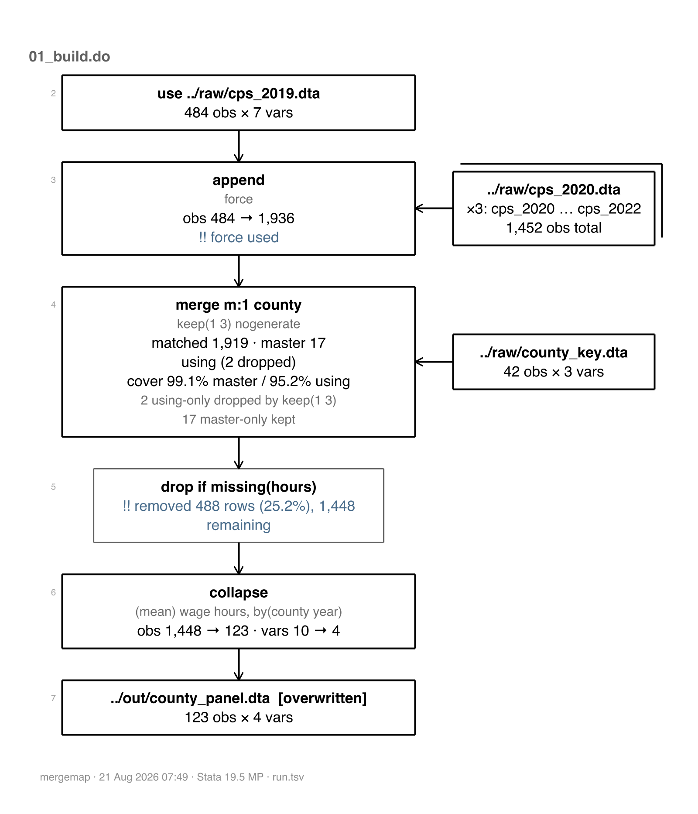
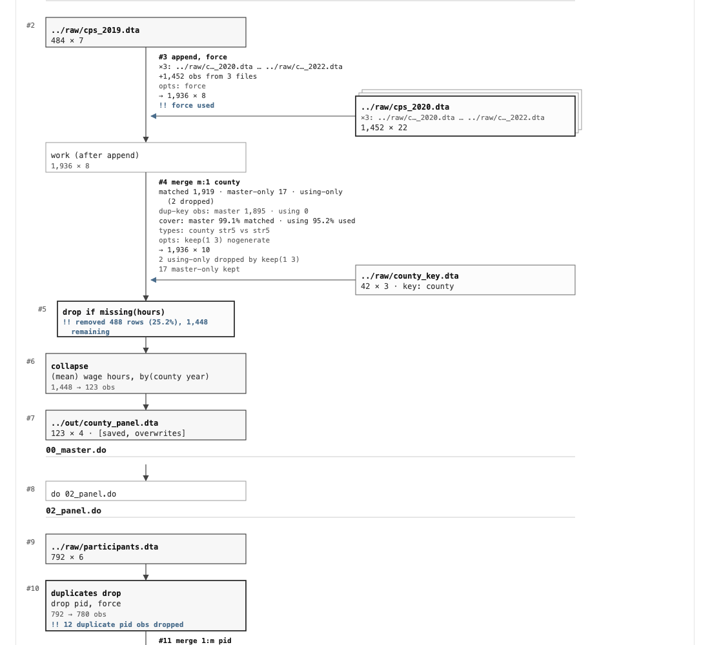
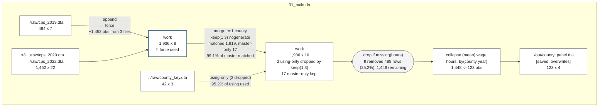
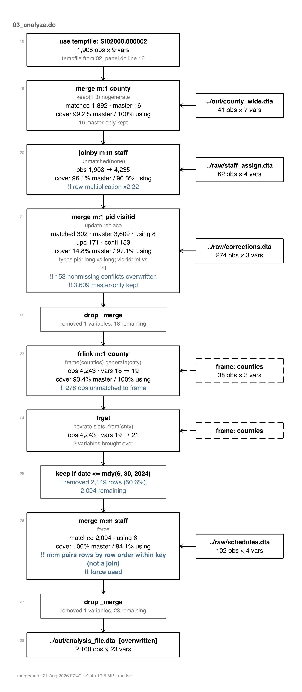

# mergemap

**Map the merges, appends and joins buried in your do-files — as a receipt, a diagram, or a figure for your appendix. Scans your code without running it; runs it when you want the real numbers.**

`mergemap` reads a sequence of do-files and reports every `merge`, `append`, `joinby`, `cross`, `frlink` and `frget`, together with the reshaping steps around them (`reshape`, `collapse`, `contract`, `xpose`, `fillin`, `duplicates`) and the filtering steps that quietly change your row count (`keep if`, `drop if`). By default it **executes nothing**: it reads the code the way you would read it and prints a numbered receipt of what it found.



## Why you'd reach for this

**You inherited a project.** Six numbered do-files, a `build/` folder, and no idea which file feeds which. One command gives you the shape of it before you read a line.

**A merge went wrong and you cannot find where.** The dataset came out at 1,448 rows and you expected 1,936. `mergemap` shows you the `drop if missing(hours)` on line 31 that took 488 of them — because when a dataset ends up smaller than expected, the merge usually gets the blame and a `drop if` three lines later is usually the culprit. Both are in the picture.

**You need a figure of the data pipeline.** For a methods appendix, a data-management memo, or a slide explaining to a client how twelve raw files became one analysis file. `mergemap draw, export(png)` gives you the figure; `export(html)` gives you a page; `export(mermaid)` gives you text GitHub and Quarto render themselves.

**You want to know what your joins actually did.** Not just "it merged" but: 99.1% of the master matched, 95.2% of the crosswalk was ever used, the key is `str5` on both sides, 1,895 duplicate key values in the master, and the two unmatched using rows were dropped by `keep(1 3)`.

**You are teaching joins, or learning them.** `mergemap sql` draws every join form as row pairings with its size rule, and `mergemap detail #, teach` draws *your* join the same way, with your counts in it.

> [!NOTE]
> `mergemap` describes work you have already done. It does not write joins for you, it does not change your code, and in its default mode it does not execute anything.

---

## Install

`mergemap` is self-contained: the commands and the help file, with no external Stata dependencies, no Python, no LaTeX, and nothing to download at run time.

```stata
net install mergemap, ///
    from("https://raw.githubusercontent.com/ericabooth/mergemap-stata-public/main/") ///
    replace force
discard
which mergemap
help mergemap
```

The package ships `mergemap.pkg` and `stata.toc`, so Stata's installer picks up every file in one call; no manual `adopath` step is needed. To pull a local copy of the regression battery, `net get` the ancillary do-file:

```stata
net get mergemap, ///
    from("https://raw.githubusercontent.com/ericabooth/mergemap-stata-public/main/")
```

Requires Stata 16 or later (the frames era).

## Start here

```stata
mergemap demo
```

That writes three small do-files into a new folder, scans them, and shows you the output. The example is built only from `sysuse auto` and `sysuse census`, so nothing is downloaded and nothing needs preparing — and the generated do-files really run, so you can execute them and then map them for real.

Then point it at your own work, in the order you run it:

```stata
mergemap 01_clean.do 02_merge.do 03_analyze.do
mergemap build/                 // a folder, in name order
mergemap 0*.do                  // a pattern
mergemap, folder(build)         // or the explicit option
```

## The receipt

Every scan prints a numbered index of what was found, in the order the code performs it.

```
1 of 2 joins flagged: 1 warn.
+-----------------------------------------------------------------------------------------+
| mergemap receipt: 01_build.do  (6 events, scan mode - nothing executed)                 |
+-----------------------------------------------------------------------------------------+
  # file        line command   keys        using/result            F flags
-------------------------------------------------------------------------------------------
  1 01_build.do   12 use                   ../raw/cps_2019.dta
  2 01_build.do   15 append x3             ../raw/cps_`y'.dta      F !! force used
  3 01_build.do   22 merge m:1 county      ../raw/county_key.dta     keep(1 3): using-only
                                                                     will be dropped
  4 01_build.do   31 drop if               missing(hours)
  5 01_build.do   40 collapse  county year
  6 01_build.do   42 save                  ../out/county_panel.dta
-------------------------------------------------------------------------------------------
6 events. Severity: !! marks warn and stop.
```

`#` is the event number and `file`/`line` say where to go and fix it. `F` marks `force`, which lets Stata push past a type mismatch it would otherwise refuse. `!!` marks anything worth a look, always as text — never as colour alone, so it survives a log file and a monochrome printout. A loop appears once, as `x3`, rather than as three near-identical rows.

## Scan mode and run mode

**Scan mode is the default, and it is safe.** `mergemap` reads your do-files as text and never executes them, so it works on code that will not currently run, on someone else's project, and on files whose data you do not have. What it cannot know is anything that exists only at run time: no observation counts, no match counts.

**Run mode executes your do-files** with instrumentation around each join and records what actually happened.

```stata
mergemap run 01_clean.do 02_merge.do 03_analyze.do
```

```
mergemap: merge m:1 county using ../raw/county_key.dta   (01_build.do line 22)
    key: county   county: str5 vs str5
    master 1,936 | using 42 | matched 1,919 | result 1,936
    coverage: 99.1% of master matched, 95.2% of using used
    top unmatched keys: 48999 (17)
    2 using-only dropped by keep(1 3); 17 master-only kept
```

Coverage is reported as a **share of each side** because raw counts do not scale-normalize: 500 unmatched rows means nothing until you know whether that is 2% or 40%, and a lookup table that goes mostly unused usually means the key is wrong. The unmatched-keys line separates "500 rows failed to match" from "one key failed to match 500 times".

> [!IMPORTANT]
> **Run mode does not change your results.** The wrappers call the real commands and pass your options through untouched, and the regression suite proves it: the pipeline is run plainly, then again under `mergemap run`, and every saved dataset must come out identical on `datasignature`, `cf _all`, the sort flag, and `describe`. Getting there turned up a genuinely subtle failure mode — the instrumentation's own bookkeeping was advancing Stata's sort RNG, which changed how `collapse` broke ties, which changed group means in their last bits. Every measurement helper now saves and restores `c(sortrngstate)` and `c(rngstate)` on every exit path.

Use scan when you want the shape. Use run when you want the truth.

## Drawing the map

```stata
mergemap draw                                            // Results window, or HTML if too big
mergemap draw, export(png)  saving(figures/pipeline)     // a figure for a paper
mergemap draw, export(html) saving(pipeline.html)        // a self-contained page
mergemap draw, export(mermaid) saving(pipeline)          // text GitHub renders itself
```

With no argument, `draw` renders the most recent journal — remembered across `clear all` and across sessions in the same directory — so `mergemap build/` followed by `mergemap draw` is the whole loop.



The HTML page is **self-contained**: no internet, no JavaScript, no external assets. It opens by double-click, and `mergemap` prints a clickable link to it in the Results window.

| `export()` | what you get |
|---|---|
| `smcl` | the drawing in the Results window (the default) |
| `html` | a self-contained page, hover a node for its full ledger |
| `png` / `svg` | a picture through Stata's own graph engine |
| `mermaid` | text GitHub, Quarto and VS Code render with nothing installed |
| `dot` | Graphviz text; online viewers cover anyone without Graphviz |
| `erdiagram` | mermaid's ER flavour: keys as attributes, crow's-foot cardinality |

**When the Results window is too small.** A window is a fixed-width space, so past `maxnodes()` events (default 8), or whenever `layout(horizontal)` is asked for, the SMCL drawing steps aside and `draw` writes the HTML page instead. `forcesmcl` overrides. A PNG too dense for one readable image splits itself into one page per do-file, which is also available on demand as `page(dofile)`.

### It renders on GitHub, too

`export(mermaid)` writes a flowchart this very page can display — the block below came straight out of the command:



### Putting a map in a report

For Word or LaTeX, `export(png)` or `export(svg)` and insert the file as a figure. Inside a [`webdoc`](https://ideas.repec.org/c/boc/bocode/s458530.html) or [`webdoc2`](https://github.com/ericabooth/webdoc2-stata-public) report, add `embed`:

```stata
mergemap draw, export(html) saving(pipe_frag.html) embed details replace
```

That writes a **fragment**, not a page: every CSS selector scoped under `.mm-`, every id namespaced per diagram, and an SVG carrying only a `viewBox`. It flows and prints with the report and cannot restyle the document around it — which a full page can and does, as the testing that motivated `embed` found out the hard way.

## Teaching the joins

```stata
mergemap sql            // the Stata / SQL / dplyr / pandas translation table
mergemap sql joinby     // one form, drawn as row pairings with its size rule
```

A join is a cartesian product with a filter. That is why a join can return *more* rows than either input, and why the familiar overlapping-circles picture cannot explain the joins that actually go wrong.

```
mergemap sql: joinby id using B  (the real many-to-many)
within each key, every master row is paired with every using row: a cross
product inside the key

  master              using               result
  +------------+    +------------+    +------------------+
  | id   x     |    | id   y     |    | id   x    y      |
  | 1    a     |    | 1    p     |    | 1    a    p      |
  | 1    b     |    | 1    q     |    | 1    a    q      |
  +------------+    +------------+    | 1    b    p      |
                                      | 1    b    q      |
                                      +------------------+

  size rule, per key: rows = rows(master) x rows(using);  4 = 2 x 2
  2 rows and 2 rows made 4: joins can multiply, which is why mergemap
  reports row multiplication on every joinby

  SQL: INNER JOIN, dup keys  |  dplyr: many-to-many  |  pandas: validate="m:m"
```

Pictures exist for `full`, `left`, `inner`, `fanout`, `joinby`, `append`, `cross`, and `mm`.

**And they connect back to your own work.** `mergemap detail #, teach` draws event `#` from your journal in the same style, with the toy rows replaced by its observed counts:

```
event 4, drawn: merge m:1 county

  master: 1,936 rows                   using: 42 rows
  key: county                          file: ../raw/county_key.dta
        |
        |  merge m:1 county, keep(1 3) nogenerate
        v
  result: 1,936 rows
  +--------------------------------------------+
  |  matched                            1,919  |
  |  master-only                           17  |
  |( using-only                     2 dropped )|
  +--------------------------------------------+
  coverage: 99.1% of master matched, 95.2% of using used
```

Categories a `keep()` dropped are parenthesized, so the box's arithmetic agrees with the result count it sits under.

## Commands

| command | what it does |
|---|---|
| `mergemap` *dofiles* | **scan** — the default; executes nothing |
| `mergemap demo` | write a worked example, scan it, show the output |
| `mergemap check` *dofiles* | print only the flagged events |
| `mergemap run` *dofiles* | execute with instrumentation and record what happened |
| `mergemap draw` | draw the map: Results window, HTML, PNG/SVG, mermaid, DOT, ER |
| `mergemap sql` | teach any join form as a row-pairing picture |
| `mergemap list` | the journal as a table; `full` for every column |
| `mergemap detail` *#* | everything about one event; `teach` draws it with its counts |
| `mergemap export` | the journal as a `.dta` or `.csv`, counts arriving numeric |
| `mergemap receipt` *journal* | reprint a receipt from a saved journal |
| `mergemap clear` | forget the remembered journal; files are never touched |

### Options worth knowing

**Where to look.** `folder(path)` reads the `.do` files in a folder in name order — though you rarely need it, since a folder passed as the argument does the same thing. A missing `.do` extension is supplied for you, patterns like `0*.do` expand, and a mistyped name answers *did you mean 01_build.do?*

**What to write.** `out(filename)` puts the journal where you want it (default `journal.tsv`); `noreceipt` skips the table. The journal is tab-separated with one line per event and it is the record everything else is built from — worth keeping, and readable straight back into Stata.

**How loudly to complain.** `warn(#)` and `stop(#)` take either a count (`warn(500)`) or a share (`warn(.05)`, the default). Events sort into `note`, `warn` and `stop`, because 2% unmatched is worth a note and 40% is a crisis and one warning symbol cannot say which. **A `stop` makes `mergemap run` exit with an error**, so it works as a gate in a master do-file rather than only as a report.

**Run mode only.** `examples(#)` lists sample rows per join showing the keys and `_merge` — never whole rows. `nochecks` skips the duplicate-key scan of using files, which is the expensive part on large data.

**Drawing.** `style(boxes|rail)` picks full boxes (the default) or a compact rail; `layout(vertical|horizontal)` picks down the page or across it; `compact`, `nocounts`, `nokeys`, `notransforms` and `noellipsis` leave things out; `details` folds per-join ledgers into the HTML; `accent(hex)` sets the single colour used for flags and arrowheads; `noopen` writes the HTML without opening a browser.

## Flags, and what to do about them

Here is a do-file with real problems in it — a many-to-many `joinby` that more than doubles the rows, an `update replace` where only 15% of the master matched, a `keep if` that removes half the data, and a `merge m:m` pushed through with `force`:



| flag | what it means |
|---|---|
| `!! m:m` | `merge m:m` is **not a join**. It pairs rows by position within the key, which depends on the order your data happen to be in. If you want all pairings use `joinby`; if you meant a lookup use `m:1`. |
| `!! force` | `force` let a type mismatch through. The merge succeeded and the values may be wrong. |
| `!! type` | The key is stored differently on the two sides, e.g. `id: str6 vs long`. This is the quietest way a merge fails. |
| `!! unmatched` | Rows found no partner. Often fine, sometimes the whole bug. |
| `!! also saved by` | Two do-files write the same file. Whichever runs last wins, which is rarely what anyone intended. |
| `!! stale` | A saved dataset is older than something it was built from, so it does not reflect the current code. Reported only — rebuilding is [`project`](https://ideas.repec.org/c/boc/bocode/s457685.html)'s job. |

## Limitations

These are boundaries of the approach, not bugs.

In scan mode, anything built at run time stays unresolved. A file name assembled from a macro appears as it is written in your code, and a loop over a list built from a directory listing cannot be counted. Both are **flagged rather than guessed at**, and run mode resolves them.

A join performed inside a command you wrote yourself, or built up as text and then executed, is invisible. That includes the merge wrappers on SSC: if your code uses `mmerge`, `dmerge`, `mergeall` or `pullin`, `mergemap` sees the wrapper and not the join inside it. It reads code, not intentions.

`mergemap run` rewrites your do-files into temporary copies with instrumented command names, keeping your line numbers. It does not alter your files. If a do-file uses `#delimit ;`, the scan is best-effort and says so, and run mode leaves that region uninstrumented. Do not nest `mergemap run` inside `webdoc do` — both take control of how a do-file is executed.

## See also

- [`precombine`](https://www.stata-journal.com/article.html?article=dm0080) (Chatfield) — compares datasets *before* you combine them, including whether their value-label code sets agree. A pre-flight check; `mergemap` is the map afterwards. Use both.
- [`project`](https://ideas.repec.org/c/boc/bocode/s457685.html) (Picard) — tracks dependencies and re-runs what changed. `mergemap` reports staleness but never rebuilds.
- [`iedropone`](https://github.com/worldbank/ietoolkit) (World Bank DIME) — drops observations and errors unless exactly the expected number went.
- [`flowchart`](https://ideas.repec.org/c/boc/bocode/s458387.html) (Dodd) — CONSORT and PRISMA participant-flow diagrams. Different domain, and it needs LaTeX.
- [`sankey`](https://github.com/asjadnaqvi/stata-sankey) (Naqvi) — flow widths from `from`/`to`/`value` data.
- Eric's other Stata packages: [github.com/ericabooth](https://github.com/ericabooth)

## Repository layout

| path | contents |
|---|---|
| `src/` | the package: `mergemap.ado`, the `_mm_*` helpers, and the help file |
| `tests/` | test data, 21 scenarios, a 3-file pipeline, and the regression battery |
| `tests/runmode/` | the run-mode transparency regression |
| `proto/` | the journal schema and the design notes behind it |
| `gallery/` | every renderer's output assembled into one self-contained page |

Running the tests:

```stata
cd tests
do mergemap_pkgtest.do
```

`PLAN.md` carries the design and the reasoning behind it, `DECISIONS.md` the choices made and rejected, `CONCEPTMAP.md` a table mapping every Stata combining verb to its SQL, dplyr and pandas equivalent, and `CHANGELOG.md` what changed and when.

## Author and license

Eric A. Booth, Sr Researcher, Texas 2036 (eric.a.booth@gmail.com).

Issues and PRs welcome at [github.com/ericabooth/mergemap-stata-public](https://github.com/ericabooth/mergemap-stata-public).

MIT. See [LICENSE](LICENSE). Copyright (c) 2026 Eric A. Booth.
