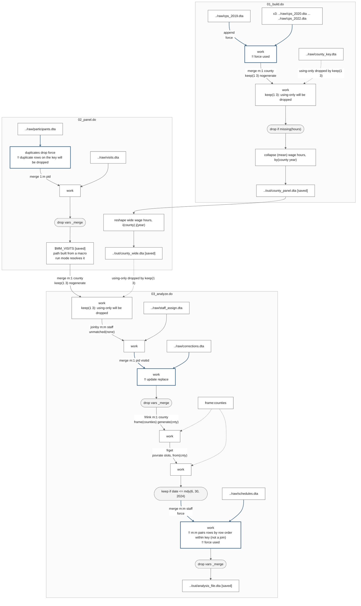

# mergemap: journal_pipeline.tsv - mermaid, vertical

Boxes are datasets; the spine is the dataset in memory. A slim rounded node is a row filter. `!!` marks an event that needs attention.

*mergemap _mm_rendertext 0.2.0 - journal journal_pipeline.tsv - rendered 21 Aug 2026 08:33:32 - Stata 19.5 MP - git main@057d6df*

