# mergemap: journal_run.tsv - mermaid, horizontal

Boxes are datasets; the spine is the dataset in memory. A slim rounded node is a row filter. `!!` marks an event that needs attention.

*mergemap _mm_rendertext 0.2.0 - journal journal_run.tsv - rendered 21 Aug 2026 08:33:32 - Stata 19.5 MP - git main@057d6df*

```mermaid
%%{init: {'theme':'base','themeVariables':{'fontFamily':'Helvetica, Arial, sans-serif','fontSize':'14px','primaryColor':'#ffffff','primaryTextColor':'#202020','primaryBorderColor':'#606060','lineColor':'#606060','secondaryColor':'#f4f4f4','tertiaryColor':'#fafafa','clusterBkg':'#fbfbfb','clusterBorder':'#b0b0b0','edgeLabelBackground':'#ffffff','titleColor':'#202020'}}}%%
%% mergemap _mm_rendertext 0.2.0 - journal journal_run.tsv - rendered 21 Aug 2026 08:33:32 - Stata 19.5 MP - git main@057d6df
flowchart LR
  accTitle: mergemap data-flow map of journal_run.tsv
  accDescr {
    3 do-files, 8 dataset events, 9 joins and 2 filters, of which 5 are flagged. Boxes are datasets or the dataset in memory; edges carry the command, its keys and its counts. Two exclamation marks flag an event that needs attention.
  }
  classDef default fill:#ffffff,stroke:#606060,color:#202020;
  classDef mmfilter fill:#f4f4f4,stroke:#909090,color:#202020;
  classDef mmnote fill:#fafafa,stroke:#b0b0b0,color:#404040;
  classDef mmwarn fill:#ffffff,stroke:#4a6d8c,stroke-width:2.5px,color:#202020;
  classDef mmstop fill:#ffffff,stroke:#4a6d8c,stroke-width:4px,color:#202020;
  subgraph sg1["01_build.do"]
    d6["raw/cps_2019.dta<br/>52,431 x 24"]
    d7["x3: raw/cps_2020.dta ... raw/cps_2022.dta<br/>157,203 x 24"]
    s2["work<br/>209,634 x 24"]
    d13["xwalk/county_key.dta<br/>254 x 3"]
    s3["work<br/>209,634 x 26<br/>2 using-only dropped by keep(1 3)"]
    s4(["drop if missing(wage)<br/>!! removed 6,519 rows (3.1%), 203,115 remaining"])
    s5["collapse (mean) wage hours, by(county year)<br/>203,115 -> 3,048 obs"]
    d2["built/county_panel.dta [saved]<br/>3,048 x 6"]
  end
  subgraph sg2["02_panel.do"]
    d8["raw/participants.dta<br/>8,914 x 12"]
    s8["duplicates drop pid<br/>8,914 -> 8,902 obs<br/>!! 12 duplicate pid obs dropped"]
    d11["raw/visits.dta<br/>41,210 x 6"]
    s9["work<br/>41,520 x 17<br/>310 master-only kept (no visits)"]
    d12["tempfile:__visits [tempfile]<br/>41,520 x 17"]
    s12["reshape wide wage hours, i(county) j(year)<br/>3,048 -> 762 obs"]
    d3["built/county_wide.dta [saved]<br/>762 x 9"]
  end
  subgraph sg3["03_analyze.do"]
    s15["work<br/>41,520 x 25<br/>95 master-only kept"]
    d10["raw/staff_assign.dta<br/>118 x 4"]
    s16["work<br/>44,873 x 28<br/>!! row multiplication x1.08"]
    d5["raw/corrections.dta<br/>400 x 5"]
    s17["work<br/>44,873 x 28<br/>!! 50 nonmissing conflicts overwritten"]
    d4["frame:counties<br/>254 x 7"]
    s18["work<br/>44,873 x 29<br/>95 obs unmatched to frame"]
    s19["work<br/>44,873 x 31"]
    s20(["keep if inrange(year, 2019, 2022)<br/>removed 753 rows (1.7%), 44,120 remaining"])
    d9["raw/schedules.dta<br/>560 x 6"]
    s21["work<br/>44,120 x 33<br/>!! stop<br/>!! m:m pairs rows by order within key (not a join)<br/>!! force: schednote str8 vs byte<br/>!! key type mismatch: schednote: byte vs str8"]
    d1["built/analysis_file.dta [saved]<br/>44,120 x 33"]
  end
  d6 -- "append<br/>+157,203 obs from 3 files" --> s2
  d7 --> s2
  s2 -- "merge m:1 county<br/>keep(1 3) nogenerate<br/>matched 209,101, master-only 533<br/>99.7% of master matched" --> s3
  d13 -. "using-only (2 dropped)<br/>99.2% of using used" .-> s3
  s3 --> s4
  s4 --> s5
  s5 --> d2
  d8 --> s8
  s8 -- "merge 1:m pid<br/>matched 41,210, master-only 310<br/>96.5% of master matched" --> s9
  d11 -- "100.0% of using used" --> s9
  s9 --> d12
  d2 --> s12
  s12 --> d3
  d12 -- "merge m:1 county<br/>keep(1 3) nogenerate<br/>matched 41,425, master-only 95<br/>99.8% of master matched" --> s15
  d3 -- "94.1% of using used" --> s15
  s15 -- "joinby m:m staff<br/>unmatched(none)<br/>100.0% of master matched" --> s16
  d10 -- "100.0% of using used" --> s16
  s16 -- "merge 1:1 pid visitid<br/>update replace<br/>matched 0, master-only 44,473, updated 350 missing, 50 conflicts overwritten<br/>0.9% of master matched" --> s17
  d5 -- "100.0% of using used" --> s17
  s17 -- "frlink m:1 county<br/>frame(counties)<br/>matched 44,778, master-only 95<br/>99.8% of master matched" --> s18
  d4 -. "93.7% of using used" .-> s18
  s18 -- "frget<br/>povrate slots, from(cnty)" --> s19
  d4 -.-> s19
  s19 --> s20
  s20 -- "merge m:m staff<br/>force<br/>matched 43,906, master-only 210<br/>99.5% of master matched" --> s21
  d9 -- "using-only 4<br/>99.3% of using used" --> s21
  s21 --> d1
  class s4 mmwarn;
  class s8 mmwarn;
  class s16 mmwarn;
  class s17 mmwarn;
  class s20 mmfilter;
  class s21 mmstop;
  linkStyle 4,7,15,16,17,18,24,25 stroke:#4a6d8c,stroke-width:2px;
```

