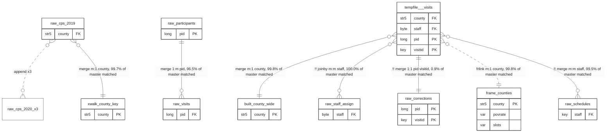

# mergemap: journal_run.tsv - mermaid, erDiagram

Entities are datasets, attributes are the keys they were joined on, and the glyph carries the Stata subtype: `||--||` is 1:1, `}o--||` is m:1, `||--o{` is 1:m, `}o--o{` is m:m or joinby. A dotted line is a link that does not pair rows on a key: append, or frlink.

*mergemap rendertext 0.2.0 - journal journal_run.tsv - rendered 19 Aug 2026 23:55:36 - Stata 19.5 MP*

